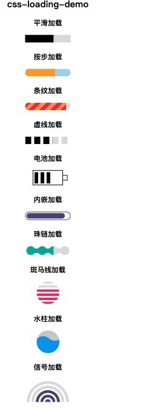

## css-loading
记录下 css 动画的魅力(Note the charm of CSS animations)
### css-loading-demo



例如 1. 平滑加载
```html
<div class="progress-1"></div>
```
```css
.progress-1 {
  width:120px;
  height:20px;
  background:
   linear-gradient(#000 0 0) 0/0% no-repeat
   #ddd;
  animation:p1 2s infinite linear;
}
@keyframes p1 {
    100% {background-size:100%}
}
```
linear-gradient(#000 0 0) 你可以理解为 linear-gradient(#000 0 100%)，如果还不熟悉，复制 linear-gradient(#000 0 50%, #f00 50% 0) ，替换原先的部分跑一下。觉得 linear-gradient(#000 0 0) 别扭的话，直接写 #000 即可。
0/0% 是 background-position: 0;/background-size: 0; 的简写。


### 参考
[https://juejin.cn/post/7080542771387301896](https://mp.weixin.qq.com/s/aZTtciddkLXYwWiBrXRFPw)
[follow twitter ChallengesCss](https://twitter.com/ChallengesCss)
[the article links](https://twitter.com/ChallengesCss/status/1500437014616940546?cxt=HHwWhIC5gfzgz9IpAAAA)

